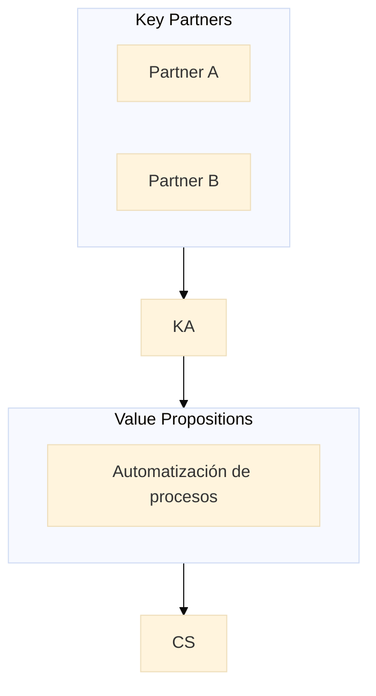

# Sistema de Visualización - Referencia

## Índice

1. [Introducción](#introducción)
2. [Importación](#importación)
3. [Clase Visualizer](#clase-visualizer)
4. [Visualizaciones de BMC](#visualizaciones-de-bmc)
5. [Visualizaciones de Lean Canvas](#visualizaciones-de-lean-canvas)
6. [Gráficos Financieros](#gráficos-financieros)
7. [Matriz de Riesgos](#matriz-de-riesgos)
8. [Scorecard de Evaluación](#scorecard-de-evaluación)
9. [Ejemplos Completos](#ejemplos-completos)

---

## Introducción

El módulo de visualización genera representaciones visuales automáticas en formato ASCII, Mermaid y Markdown. Diseñado para ser integrado en el documento final por `midi-writer-agent`.

### Formatos de Salida

| Formato | Uso | Requisito |
|---------|-----|-----------|
| ASCII | Terminales, documentos de texto | Fuente monoespaciada |
| Mermaid | Documentación web, GitHub | Renderizador Mermaid |
| Markdown | Documentos, wikis | Cualquier viewer Markdown |

---

## Importación

```javascript
import { Visualizer } from 'midi-framework';

// O importar funciones individuales
import {
  generateBMCVisual,
  generateLeanCanvasVisual,
  generateFinancialCharts,
  generateRiskMatrix,
  generateScorecardVisual
} from 'midi-framework';
```

---

## Clase Visualizer

### Constructor

```javascript
const visualizer = new Visualizer(outputPath);
```

| Parámetro | Tipo | Descripción |
|-----------|------|-------------|
| `outputPath` | string (opcional) | Directorio para guardar archivos |

### Método Principal

```javascript
const visualizations = await visualizer.generateAll(data);
```

**Parámetro `data`:**

```javascript
{
  bmc: { /* datos del canvas */ },
  leanCanvas: { /* datos lean canvas */ },
  financials: { /* datos financieros */ },
  risks: { /* datos de riesgos */ },
  evaluation: { /* datos de evaluación */ }
}
```

**Retorno:**

```javascript
{
  bmc: { ascii, mermaid, markdown },
  leanCanvas: { ascii, mermaid, markdown },
  financials: { revenue, cashFlow, scenarios, burnRate, breakeven },
  risks: { matrix, distribution, timeline, summary },
  evaluation: { overall, dimensions, strengths, weaknesses, radar }
}
```

---

## Visualizaciones de BMC

### generateBMCVisual

Genera visualizaciones del Business Model Canvas.

#### ASCII

```javascript
import { generateBMCVisual } from 'midi-framework';

const bmcData = {
  keyPartners: ['Partner A', 'Partner B'],
  keyActivities: ['Desarrollo', 'Ventas'],
  keyResources: ['Plataforma', 'Equipo'],
  valuePropositions: ['Automatización de procesos'],
  customerRelationships: ['Soporte personalizado'],
  channels: ['Directo', 'Online'],
  customerSegments: ['PYMEs', 'Startups'],
  costStructure: ['Desarrollo', 'Marketing'],
  revenueStreams: ['Suscripción mensual']
};

const asciiChart = generateBMCVisual.ascii(bmcData);
```

**Salida:**
```
┌─────────────────────────────────────────────────────────────┐
│                      BUSINESS MODEL CANVAS                   │
├────────────────┬────────────────┬────────────────┬──────────┤
│  KEY PARTNERS  │ KEY ACTIVITIES │ VALUE PROP.    │ CUSTOMER │
│                │                │                │ RELATION.│
│ • Partner A    │ • Desarrollo   │ • Automatizar  │ • Soporte│
│ • Partner B    │ • Ventas       │   procesos     │   person.│
├────────────────┼────────────────┤                ├──────────┤
│                │ KEY RESOURCES  │                │ CHANNELS │
│                │ • Plataforma   │                │ • Directo│
│                │ • Equipo       │                │ • Online │
├────────────────┴────────────────┴────────────────┴──────────┤
│  CUSTOMER SEGMENTS: PYMEs, Startups                          │
├─────────────────────────────────┬────────────────────────────┤
│  COST STRUCTURE                 │  REVENUE STREAMS           │
│  • Desarrollo, Marketing        │  • Suscripción mensual      │
└─────────────────────────────────┴────────────────────────────┘
```

#### Mermaid

```javascript
const mermaidDiagram = generateBMCVisual.mermaid(bmcData);
```

**Salida:**


#### Markdown

```javascript
const markdownTable = generateBMCVisual.markdown(bmcData);
```

---

## Visualizaciones de Lean Canvas

### generateLeanCanvasVisual

Genera visualizaciones del Lean Canvas.

```javascript
const leanData = {
  problem: ['Problema 1', 'Problema 2'],
  solution: ['Solución 1', 'Solución 2'],
  uniqueValueProposition: 'Único en el mercado',
  unfairAdvantage: 'Tecnología propietaria',
  customerSegments: ['Segmento A'],
  channels: ['Online'],
  revenueStreams: ['Suscripción'],
  costStructure: ['Desarrollo'],
  keyMetrics: ['MRR', 'CAC'],
  existingAlternatives: ['Excel', 'Manual']
};

const asciiLean = generateLeanCanvasVisual.ascii(leanData);
const mermaidLean = generateLeanCanvasVisual.mermaid(leanData);
const markdownLean = generateLeanCanvasVisual.markdown(leanData);
```

---

## Gráficos Financieros

### generateFinancialCharts

#### Revenue Projection

```javascript
const financialData = {
  projections: [
    { revenue: 5000 }, { revenue: 7000 }, { revenue: 10000 },
    // ... 12 meses
  ],
  totalYear1: 120000
};

const revenueChart = generateFinancialCharts.revenue(financialData);
```

**Salida:**
```
## Revenue Projection (12 Months)

Revenue ($10K max)
  │
  │████                  $10,000
  │██████                $7,000
  │███████               $5,000
  └──────────────────────
   E  F  M  A  M  J  J  A  S  O  N  D

Total Year 1: $120,000
```

#### Cash Flow

```javascript
const cashFlowData = {
  cashFlow: [
    { netFlow: -5000, cumulative: -55000 },
    { netFlow: -3000, cumulative: -58000 },
    { netFlow: 2000, cumulative: -56000 },
    // ...
  ]
};

const cashFlowChart = generateFinancialCharts.cashFlow(cashFlowData);
```

#### Scenarios

```javascript
const scenarioData = {
  scenarios: {
    pessimistic: { year1Revenue: 50000, probability: '20%' },
    realistic: { year1Revenue: 100000, probability: '60%' },
    optimistic: { year1Revenue: 150000, probability: '20%' }
  }
};

const scenarioChart = generateFinancialCharts.scenarios(scenarioData);
```

**Salida:**
```
## Scenario Analysis

Year 1 Revenue Comparison

Pessimistic  │████████████│ $50,000
Realistic    │████████████████████████│ $100,000
Optimistic   │████████████████████████████████│ $150,000
             └────────────────────────────────┘
```

#### Burn Rate

```javascript
const burnData = {
  monthlyBurnRate: 5000,
  runway: 12,
  cashBalance: 60000
};

const burnChart = generateFinancialCharts.burnRate(burnData);
```

**Salida:**
```
## Burn Rate & Runway

Monthly Burn Rate: $5,000
Cash Balance: $60,000

Runway: 12 months

████████████████████████░░░░░░
▲▲▲▲▲▲▲▲▲▲▲▲▲▲▲▲▲▲▲▲▲▲▲▲△△△△△△
<─── Cash Available ───><── Need Funding ──>

Funding Status: ✅ Healthy runway
```

#### Break-Even

```javascript
const breakEvenData = {
  fixedCosts: 10000,
  contributionMargin: 80,
  breakevenUnits: 125,
  currentUnits: 50,
  breakevenMonths: 8
};

const breakEvenChart = generateFinancialCharts.breakeven(breakEvenData);
```

---

## Matriz de Riesgos

### generateRiskMatrix

#### Risk Matrix

```javascript
const riskData = {
  risks: [
    { id: '001', category: 'Mercado', probability: 'alta', impact: 'alto' },
    { id: '002', category: 'Técnico', probability: 'media', impact: 'medio' },
    { id: '003', category: 'Financiero', probability: 'baja', impact: 'alto' }
  ]
};

const matrixChart = generateRiskMatrix.matrix(riskData);
```

**Salida:**
```
## Risk Matrix (Probability vs Impact)

                           IMPACT
                  Bajo       Medio      Alto
              ┌───────────┬───────────┬───────────┐
         Alta │ 🟡 #002   │ 🔴 #001   │ 🔴       │
              ├───────────┼───────────┼───────────┤
PROBABILIDAD  │ 🟢       │ 🟡       │ 🔴       │
    Media     │           │           │           │
              ├───────────┼───────────┼───────────┤
         Baja │ 🟢       │ 🟢       │ 🟡 #003  │
              └───────────┴───────────┴───────────┘

Legend: 🔴 Alto  🟡 Medio  🟢 Bajo

Risk Distribution:
- 🔴 High Severity: 1
- 🟡 Medium Severity: 2
- 🟢 Low Severity: 0
```

#### Risk Distribution

```javascript
const distributionChart = generateRiskMatrix.distribution(riskData);
```

**Salida:**
```
## Risk Distribution by Category

Mercado       │ 🔴█ 🟡░ 🟢░ │ 1
Técnico       │ 🔴░ 🟡█ 🟢░ │ 1
Financiero    │ 🔴░ 🟡░ 🟢█ │ 1
Operacional   │ 🔴░ 🟡░ 🟢░ │ 0
              └─────────────
              🔴 Alto  🟡 Medio  🟢 Bajo
```

#### Risk Timeline

```javascript
const timelineChart = generateRiskMatrix.timeline(riskData);
```

#### Risk Summary

```javascript
const summaryChart = generateRiskMatrix.summary(riskData);
```

---

## Scorecard de Evaluación

### generateScorecardVisual

#### Overall Score

```javascript
const evaluationData = {
  finalScore: 85,
  classification: 'EXCELENTE'
};

const overallChart = generateScorecardVisual.overall(evaluationData);
```

**Salida:**
```
## Overall Score

┌──────────────────────────────────────────────────────┐
│                                                      │
│   🟢  FINAL SCORE:  85 / 100                        │
│                                                      │
│   [████████████████░░░░] 85%                        │
│                                                      │
│   Classification: EXCELENTE                          │
│                                                      │
└──────────────────────────────────────────────────────┘

✅ EXCELENTE - Listo para postular/ejecutar
```

#### Dimension Bars

```javascript
const dimensionsData = {
  dimensionScores: {
    'Problema': 90,
    'Solución': 85,
    'Innovación': 80,
    'Mercado': 75,
    'Modelo de Negocio': 88
  }
};

const barsChart = generateScorecardVisual.dimensions(dimensionsData);
```

**Salida:**
```
## Score by Dimension

🟢 Problema                │[████████████████████]  90
🟢 Solución                │[█████████████████░░░]  85
🟢 Innovación              │[████████████████░░░░]  80
🟢 Mercado                 │[███████████████░░░░░]  75
🟢 Modelo de Negocio       │[█████████████████░░░]  88
```

#### Strengths

```javascript
const strengthsData = {
  strengths: [
    { dimension: 'Innovación', score: 95, justification: 'Tecnología única' }
  ]
};

const strengthsChart = generateScorecardVisual.strengths(strengthsData);
```

#### Weaknesses

```javascript
const weaknessesData = {
  weaknesses: [
    { dimension: 'Equipo', score: 40, justification: 'Falta cofundador', improvement: 'Buscar socio técnico' }
  ]
};

const weaknessesChart = generateScorecardVisual.weaknesses(weaknessesData);
```

#### Radar Chart

```javascript
const radarData = {
  dimensionScores: {
    'Problema': 90,
    'Solución': 85,
    'Innovación': 80,
    'Mercado': 75,
    'Modelo de Negocio': 88
  }
};

const radarChart = generateScorecardVisual.radar(radarData);
```

---

## Ejemplos Completos

### Ejemplo 1: Generar Todas las Visualizaciones

```javascript
import { Visualizer } from 'midi-framework';

async function generateAllVisualizations(projectData) {
  const visualizer = new Visualizer('./output');
  
  const visualizations = await visualizer.generateAll({
    bmc: projectData.bmc,
    leanCanvas: projectData.leanCanvas,
    financials: projectData.financials,
    risks: projectData.risks,
    evaluation: projectData.evaluation
  });
  
  // Acceder a cada visualización
  console.log('BMC ASCII:', visualizations.bmc.ascii);
  console.log('Revenue Chart:', visualizations.financials.revenue);
  console.log('Risk Matrix:', visualizations.risks.matrix);
  console.log('Score:', visualizations.evaluation.overall);
  
  return visualizations;
}
```

### Ejemplo 2: Integrar en Documento Final

```javascript
import { Visualizer } from 'midi-framework';
import fs from 'fs-extra';

async function generateFinalDocument(projectData) {
  const visualizer = new Visualizer();
  
  // Generar visualizaciones
  const viz = await visualizer.generateAll(projectData);
  
  // Construir documento
  const document = `
# ${projectData.name}

## Business Model Canvas

${viz.bmc.markdown}

### Visual Representation

\`\`\`
${viz.bmc.ascii}
\`\`\`

## Financial Projections

${viz.financials.revenue}

${viz.financials.cashFlow}

${viz.financials.scenarios}

## Risk Assessment

${viz.risks.matrix}

## Final Evaluation

${viz.evaluation.overall}

${viz.evaluation.dimensions}
  `;
  
  await fs.writeFile('FINAL_DOCUMENT.md', document);
}
```

### Ejemplo 3: Solo Gráficos Financieros

```javascript
import { generateFinancialCharts } from 'midi-framework';

function quickFinancialViz(data) {
  const charts = [];
  
  charts.push(generateFinancialCharts.revenue(data));
  charts.push(generateFinancialCharts.burnRate(data));
  charts.push(generateFinancialCharts.breakeven(data));
  
  return charts.join('\n\n---\n\n');
}
```

---

## Consideraciones Técnicas

### Rendimiento

- Las visualizaciones ASCII son instantáneas
- Mermaid puede tomar 10-50ms para diagramas complejos
- `generateAll()` completo toma ~100-200ms

### Personalización

Los gráficos usan valores predeterminados que pueden ajustarse:

```javascript
// Modificar escala de gráfico
const customRevenue = generateFinancialCharts.revenue({
  ...data,
  maxRevenue: 200000  // Escala máxima personalizada
});
```

### Integración con CLI

El módulo se integra automáticamente cuando:

```bash
midi run --verbose
```

El `midi-writer-agent` invoca `Visualizer.generateAll()` antes de generar el documento final.

---

*Documentación generada para MIDI Framework v0.1.0*
